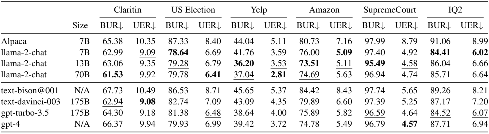

# FairSumm
Data and code for paper: Fair Abstractive Summarization of Diverse Perspectives

## Overview
In this paper, we systematically investigate fair abstractive summarization that aims to generate a fair and unbiased summary for user-generated data by providing an accurate and comprehensive view of various perspectives from different groups.
The figure shows an example from the Amazon dataset and a model-generated summary. The blue/red box displays the positive/negative reviews. The grey box contains the summary generated by GPT-3.5 (text-davinci-003). The generated summary is unfair as negative reviews are underrepresented compared with positive reviews.
<div  align="center">    

</div>

## Dataset

### Statistics
We curate a benchmark PerspectiveSumm by unifying and cleaning six existing datasets in domains where unfair summarization is a significant issue including healthcare, politics, restaurant, product, law, and policy, which covers social attributes of gender, party, sentiment, rating, and speaker. 
The table shows dataset characteristics in PerspectiveSumm for fair abstractive summarization. 


### Useage
One can directly use the preprocessed datasets in `preporcessing/dataset` with a unified format. If you want to build from scratch, you can down the following datasets from the original Github pages, including [Claritin and US Election](https://github.com/ad93/FairSumm), [Amazon and Yelp](https://github.com/abrazinskas/FewSum), [OxfordDebates](http://tisjune.github.io/research/iq2), and [SupremeCourt](https://confluence.cornell.edu/display/llresearch/Supreme+Court+Dialogs+Corpus). Then, put them into `datasets` folder and run `preprocessing/{dataset}.py` to produce the preprocessed datasets.

### Json Format
Here is an example from Amazon dataset. Please refer to `preprocessing/preprocessed_datasets/{datasetname}.json` to see more details.
```
[
  {
    "units": [ // A list of reviews
      {
        "group_id": "B003UEH9W0_2", // Showing the source of the review.
        "text": "I know that the point of these bags is for them to be for small snack items , but they were too small for most of what I wanted to use them for . I think the normal sandwich sized bags work just as well .", // Text of the review.
        "value": {
          "rating": 3 // Social attribute: Value (there could be multiple social attributes in some datasets)
        },
        "category": "health_and_personal_care" // From origin dataset.
      },
      ... // 7 other reviews
    ],
    "model_input": "I know that the point of these bags is for them to be for small snack items , but they were too small for most of what I wanted to use them for . I think the normal sandwich sized bags work just as well . || I used these for travel sized items being I hate spillage in my suitcase . I store small items such as loose herbs in them for immediate use . || I love the little Snack bags and I can no longer find them in our stores . They are just the right size for taking small snacks in the car . || Using them so sort meds on a mission clinic , but you can put chips , pretzels , pens , paper clips , hole punch holes , half a squished sandwich , or just about anything that will fit . The possibilities are endless . || Great little snack bags for treats or healthy snacks alike . They are strong , quality made bags that hold just enough . Good sealing as there is nothing worse than spilled / lost snacks , when you are counting each and every one to make up that 100 calories , LOL ! || These small bags are great for snacks . I use them for homemade trail mix or celery and carrot sticks and carry a couple of bags with me so I always have a healthy snack available . Otherwise it 's easy and tempting to grab something unhealthy when an attack of the munchies comes along . || THESE BAGS ARE THE BES , WE USE THEN IN EVERY WAY POSSIBLE AT HOME AND WHEN THE KIDS HAVE TO GO TO SCHOOL . || I love snack size bags and am happy to find them on Amazon . These bags are perfect for packing snacks on the go without using bigger sandwich bags . I also use these smaller bags to organize office and hair supplies . || I got 6 total boxes . I love the ziploc ones because of the double seal . The bags are reusable for about 5 times before they get nasty .",
    "meta": { // Some meta data (some are provided by origin dataset),
      "id": "B003UEH9W0_2.csv",
      "type": "tweets",
      "seperator": " || " // Shows the symbol that split the reviews in model_input
    },
    "value_input": {
      "rating": [ // Input reviews split by values
        "",
        "",
        "I know that the point of these bags is for them to be for small snack items , but they were too small for most of what I wanted to use them for . I think the normal sandwich sized bags work just as well .",
        "",
        "I used these for travel sized items being I hate spillage in my suitcase . I store small items such as loose herbs in them for immediate use . || I love the little Snack bags and I can no longer find them in our stores . They are just the right size for taking small snacks in the car . || Using them so sort meds on a mission clinic , but you can put chips , pretzels , pens , paper clips , hole punch holes , half a squished sandwich , or just about anything that will fit . The possibilities are endless . || Great little snack bags for treats or healthy snacks alike . They are strong , quality made bags that hold just enough . Good sealing as there is nothing worse than spilled / lost snacks , when you are counting each and every one to make up that 100 calories , LOL ! || These small bags are great for snacks . I use them for homemade trail mix or celery and carrot sticks and carry a couple of bags with me so I always have a healthy snack available . Otherwise it 's easy and tempting to grab something unhealthy when an attack of the munchies comes along . || THESE BAGS ARE THE BES , WE USE THEN IN EVERY WAY POSSIBLE AT HOME AND WHEN THE KIDS HAVE TO GO TO SCHOOL . || I love snack size bags and am happy to find them on Amazon . These bags are perfect for packing snacks on the go without using bigger sandwich bags . I also use these smaller bags to organize office and hair supplies . || I got 6 total boxes . I love the ziploc ones because of the double seal . The bags are reusable for about 5 times before they get nasty ."
      ]
    },
    "value_mapping": {
      "rating": [ // Shows the all possible values
        1,
        2,
        3,
        4,
        5
      ]
    }
  }
... // Other 1499 samples
```
## Running Models
We mainly release the code for running GPTs.

Prepare the environment:
- `pip install openai, retrying`
- `pip install nltk`

Prepare the parameters:
- modify the shell script in `models/GPTs/scripts/` and fill the key with your own OpenAI API key.
- modify other parameters as you need, such as dataset path, experiment names.

Run the model:
- `cd models`, then `bash scripts/{your_script}.sh`
The results will be in `results/{dataset_name}`

We also release the predictions of Alpaca in `models/Alpaca/results` and GPT-4 in `models/GPTs/results/` together with the repo.

## Metrics and Evaluation

### Overview
According to the definition, we propose several metrics to evaluate fairness, including Binary Unfair Rate (BUR) which measures the overall fairness in abstractive summarization by counting the number of fair summaries in the whole dataset, Unfair Error Rate (UER) which measures the distance between generated summaries and source text by computing how target distribution differs from source's. This figure shows the logic of four proposed metrics.


### Running
First prepare the third party environment. `ThirdParty` contains the code for ACUScore, BERTScore, and BARTScore. Before running metrics, we need to install these three packages following the instructions in the readme of each package (Do not clone the package from Github. Use the code in `ThirdParty`).

If you want to run from scratch, you can first install the following packages:
- git clone https://github.com/Yale-LILY/AutoACU and follow the instructions to install AutoACU;
- git clone https://github.com/neulab/BARTScore and follow the instructions to install BARTScore;
- git clone https://github.com/Tiiiger/bert_score and follow the instructions to install BERTScore; 

After installing three packages, use the files in `ThirdParty_patch` to cover the files in `ThirdParty`

Then, run the script on the predicted results.
- `cd metrics`
- modify the script in `scripts`, such as exp name, GPU id etc.
- Then run the script `bash scripts/{your_script}.sh`. The results will be in `results`

### Results
<div  align="center">    

</div>

Overall results of all datasets and models. We consider 6 datasets, 4 models, and 2 metrics. BUR and UER are better with a lower score $\downarrow$. **Bold** indicates the best performance, and <ins>underline</ins> indicates the second best. Results show that gpt-4, gpt-turbo-3.5, and text-davinci-003 obtain the best performance on 6, 4, and 2 metrics, respectively. $^\bigstar$ Alpaca produces a number of empty strings which we ignore. Thus, the results of Alpaca are not compatible with other models.
## Project Structure
```dockerignore
.
├── Analysis                               # Code for some of the anlaysis in paper, including AUC and Influence of Sentence.
├── dataset_loader                         # Load the dataset from raw data, or from the preprocessed dataset (recommand to use preprocesssed ones as default).
├── datasets                               # Use to put the raw datasets, it is empty now. One can follow the readme to dowmload them or directly use preprocessed datasets.
├── metrics                                # Metrics and and evlauation code
│   ├── results                            # Results of the evaluation will be stored here
│   ├── score                              # Core code for 4 evaluation metrics
│   ├── scripts                            # Shell scripts to run evaluation on each prediction and metrics
│   ├── utils                              # Store the code for ACUScore (deprecated)
│   └── eval.py                            # Main entrance for the evaluation.
├── models                                 # Models to run predictions on preprocessed datasets
│   ├── Alpaca                             # Alpaca only contains the results and processing, origin code can be found on Huggingface
│   └── GPTs                               # GPT models, including gpt-4, text-davinci-003, and gpt-turbo-3.5
├── preprocessing                          # Store the preprocessed datasets and scripts to preprocess raw datasets
│   └── preprocessed_datasets              # Cleaned dataset, one can directly use them (This is what we call PerspectiveSumm in paper)!
├── src                                    # readme sources
├── ThirdParty                             # Code for third party packages. I modify the original package a bit, that is why one need to cover origin ones with this folder.
│   ├── AutoACU                            # Deprecated, only used in Human Evaluation stage
│   ├── BARTScore                          # I modify the entrance a bit, it contains part of the code of BARTScore package
│   └── BERTScore                          # Similar to BARTScore
├── utils                                  # Some helper functions
└── README.md                              # This is what you are reading now :)

```

## Citation
```
@article{zhang2023fairness,
  title={Fair Abstractive Summarization of Diverse Perspectives},
  author={Yusen Zhang, Nan Zhang, Yixin Liu, Jieyu Zhao, Alexander Fabbri, Junru Liu, Ryo Kamoi, Xiaoxin Lu, Caiming Xiong, Dragomir Radev, Kathleen McKeown, Rui Zhang},
  booktitle={arxiv},
  year={2023}
}
```
